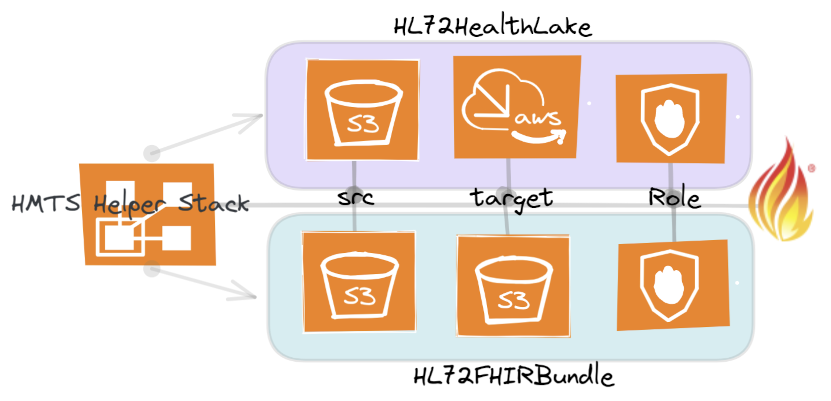

# hmts-support-stack

This is an AWS Cloudformation template that will create the source and targets and accompanying roles to quickly utilize the InterSystems Healthshare Message Transformation Service.  
 
  
 

Depending on your desired transformation type, the stack will create: 
## Resource Creation

HL7toFHIR with S3 Target:
- Source Bucket, Keys  
- Target Bucket, Keys  
- Policy  

HL7toFHIR with HealthLake Target:
- Source Bucket, Keys  
- HealthLake DataStore  
- Policy 

Quite simply, puts some automation around the documentation for setting up source and targets with appropriate role creation, [here](https://docs.intersystems.com/components/csp/docbook/DocBook.UI.Page.cls?KEY=HMTS_setting_up)